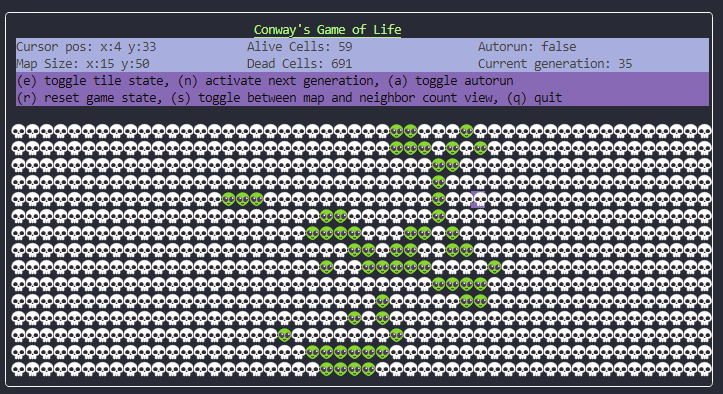
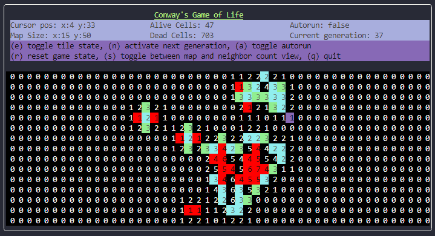

# Conway`s game of Life

This is my Conway`s game of Life implementation written in Go, using the (UI) BubbleTea library.

You can use the arrow keys to navigate map and toggle state(dead|alive) using (e).
Pressing (n) activates the next generation. Pressing (a) toggles autorun.
Furthermore you can switch between normal and stats view by pressing (s).
Pressing (q) will exit the program.

## Normal view:

## Stats view:

- The numbers correspond to the number of living neighbours.
- Red cells will die next generation.
- Blue cells survive till the next generation.
- Green cells will be born the next generation.
  
